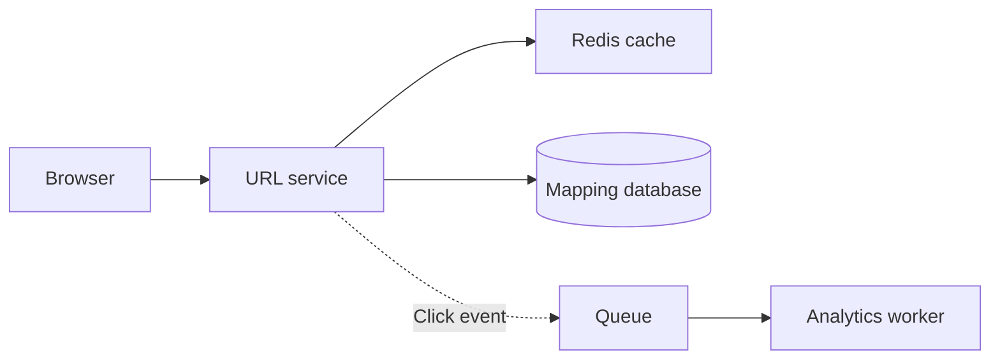

# Writing realistic system design lessons and interview answers

## Purpose and audience

Write for a learner who can follow a basic request but is still learning backend and distributed-system concepts. The goal is understanding and the ability to explain a design aloud in an interview. The learner should not need to reopen the source chat to understand the answer.

Use natural, beginner-friendly Hinglish written mostly in Roman script. Keep technical terms in English. Sound like a patient colleague explaining one idea at a time, not a textbook, marketing page, or polished AI monologue.

The original reference is the user's URL-shortener conversation:
https://chatgpt.com/s/cx_6ac4bcf09cb4819189b26246aca26db8

Repository content contains adapted explanations and labelled supplements from that conversation. A URL alone is not evidence of what a new source says: read it or use contents supplied by the user. If unavailable, ask for the source rather than inventing its initial curriculum.

## Voice: how the explanation should sound

Prefer short, connected sentences and concrete examples. Use “Maan lo”, “Socho”, “Ab”, and “Isliye” naturally, without putting them at the beginning of every paragraph. Define a term the first time it matters. Avoid unexplained jargon, repeated praise, exaggerated guarantees, and ornamental analogies.

A useful voice example:

> Maan lo Redis mein `abc123` ki mapping nahi mili. Iska matlab link missing nahi hai; sirf cache miss hai. Ab service database mein dekhegi. Valid URL mile toh Redis mein bhi store karegi, taaki next request par DB read bach jaaye.

Less useful:

> Leverage a highly scalable Redis-powered distributed caching strategy to ensure seamless ultra-low-latency redirection.

The first version explains a decision and a flow. The second names technology and promises results without explaining the mechanism.

Keep interview answers concise and speakable. Detailed explanation comes before or after the short answer. Technical headings and questions can remain in clear English; the teaching body should use simple Hinglish. Revision bullets can use Hinglish and familiar English technical terms.

## Source fidelity and provenance

Before drafting, identify:

- Which questions were actually asked?
- Which follow-ups, examples, corrections, and edge cases were discussed?
- Which answers were incomplete or left unanswered?
- What additional explanation is needed to make the lesson self-contained?

Preserve useful reasoning and corrections, not just the chat's final one-line conclusion. Correct a technical error rather than repeating it as fact. If correcting or extending a source materially, label the added explanation.

Use the schema's exact section origin values:

- `Source conversation`: faithful Hinglish adaptation of supplied source material.
- `Supplementary explanation`: newly supplied reasoning, assumptions, examples, or implementation detail beyond the source.
- `Your content`: user-authored material where applicable.

Split a supplementary subsection into its own section when needed. Do not bury a new technical guarantee inside a source-labelled section. A question can be source-derived while its answer is supplementary. Example: the source asked about sequential Base62 predictability but did not complete the answer; explain that boundary before providing the answer.

When the user supplies an exact ordered question list, cover every item in that order. Do not merge two items away because they overlap. Explain their distinct focus—for example, redirect flow is the complete request journey, while cache-aside focuses on lookup and population behavior.

## Learning progression

For each concept, use these moves where they help:

1. **Intuition:** a short familiar example, such as a ticket book or contacts book.
2. **Concept:** connect the analogy to the actual mechanism and define the term.
3. **Concrete example:** use a named code, timestamp, request, number, or timeline.
4. **Reasoning:** explain why this choice solves the current problem and what remains unsolved.
5. **Interview answer:** a concise answer the learner could say aloud.
6. **Relevant follow-up or misconception:** one important edge case, not a generic checklist.
7. **Revision:** two to four memorable takeaways.

These are teaching moves, not mandatory identical headings on every question. Adapt the structure to the subject. A numerical estimation needs worked arithmetic; a race condition needs a timeline; a failure-recovery question needs before/after state.

Introduce complexity gradually:

> Pehla version: service + DB. Har redirect mapping DB se padhta hai. Ab reads badh rahi hain, toh popular mappings cache karte hain. Cache add karne ke baad expiry aur invalidation ka behavior bhi define karna padega.

Do not start with a cloud of technologies and explain their purpose later.

## Full system-design lesson

Include only the sections the question needs:

- Problem and expected behavior; what the interviewer is evaluating.
- Clarifying questions and the agreed scope.
- Functional and non-functional requirements.
- Assumptions and capacity estimates with units and arithmetic.
- The smallest useful design and how it evolves.
- Request/data flows and readable architecture diagrams.
- API examples, data model, and storage reasoning.
- Relevant cache, queue, scaling, reliability, and failure behavior.
- Trade-offs and alternatives tied to requirements.
- Ordered interview follow-ups with detailed answers.
- Common mistakes and concise revision notes.

An API, queue, or shard section that adds no useful decision should be omitted. Never fill missing source sections with unlabelled generic material.

## Realistic interview questions and answers

A good question asks for a decision under a concrete constraint. Ask “If the cache fails, what happens to database traffic?” rather than “Explain scalability.”

A strong answer contains:

- The chosen approach and the condition that makes it suitable.
- The request/state flow.
- The relevant correctness or failure mechanism.
- A limitation or trade-off when it matters.

Example:

**Question:** How would multiple servers generate unique random short codes?

**Explanation:** Do cashiers same random ticket number likh sakte hain. Database ka unique index decide karega kaunsa insert accept hota hai. Pehle check karke phir insert karna enough nahi; dono servers same waqt “absent” dekh sakte hain.

**Interview answer:** “Har server code locally generate karega. Mapping ko UNIQUE constraint ke saath insert karunga; duplicate-code conflict par naya code bana kar retry karunga. Pre-check alone uniqueness guarantee nahi karta.”

**Follow-up:** A range allocator generation collisions avoid kar sakta hai, lekin har URL mapping DB mein save karna phir bhi required hai.

Avoid requiring memorised vendor names. Explain the role first. A candidate should know what a coordinator does, not merely say “ZooKeeper.”

## Capacity estimates

Declare the assumptions, show the arithmetic, retain units, and interpret the result.

```text
Assumption: 10,000,000 new links per day
Assumption: each gets 100 redirects within that same day
Seconds/day = 24 × 60 × 60 = 86,400
Creation RPS = 10,000,000 / 86,400 ≈ 116
Redirects/day = 10,000,000 × 100 = 1,000,000,000
Redirect RPS ≈ 11,574
```

Explain why redirects dominate and why caching may help. These are averages, not peaks. Lifetime clicks cannot be treated as daily clicks. Storage-size assumptions must be labelled and should mention index/replication overhead when relevant. Do not equate user count with instantaneous request rate.

## Architecture diagrams

Use Mermaid for static architecture and sequence/timeline diagrams. Use the smallest diagram that explains the current section. Give nodes plain role names; introduce tools in the text. Show who sends the response, who stores data, and whether a path is synchronous or asynchronous.

Example Markdown body:

````markdown

````

Explain the diagram immediately around it:

> Service Redis mein lookup karti hai; miss par database padhti hai. Redirect response service bhejti hai. Queue ka click event background analytics ke liye hai; redirect uske processing complete hone ka wait nahi karta.

Check that arrows and labels match the prose. A box named Redis should not appear to send the browser an HTTP redirect. Do not suggest a distributed transaction or consistency guarantee with an arrow alone.

For races, prefer an explicit ordered timeline. For alternatives, show separate small diagrams rather than cramming every technology into one drawing. Ensure diagrams remain readable on mobile, using contained scrolling when necessary.

## Framer Motion walkthroughs

Motion should explain a meaningful state transition, not decorate the page. Place the walkthrough beside the concept it teaches.

Each step needs:

- A short Hinglish title.
- Which components are active.
- What request/data/state changes at that moment.
- A brief explanation of why that change matters.
- A concrete note, such as `GET /abc123`, remaining TTL, or the next reserved ID.

Use manual next/back/restart controls and optional play/pause. Respect reduced-motion preferences; the written explanation must remain usable without animation. Avoid starting several animations automatically during reading.

Example JSON structure in `walkthroughs.json`:

```json
{
  "redirect": {
    "title": "Short link click hua. Ab kya hoga?",
    "nodes": ["Browser", "URL service", "Redis"],
    "steps": [
      {
        "title": "1. Browser request bhejta hai",
        "body": "User short link kholta hai. Service code ki mapping dhoondhegi.",
        "active": [0, 1],
        "note": "GET /abc123"
      }
    ]
  }
}
```

`active` values index into `nodes`. All indices must be valid. The renderer uses the current step to highlight nodes and update the explanation. Do not attach an existing URL-shortener walkthrough to an unrelated system just because it animates. New walkthrough keys need matching types in `src/types.ts`.

## Technical accuracy: URL-shortener reference rules

These lessons model the standard expected for other topics:

- Short codes reference mappings; they do not compress long URLs.
- Random Base62 codes can collide. Pre-check then insert is racy. A correctly scoped database unique constraint with duplicate retry enforces uniqueness.
- With distributed storage, explain the scope of uniqueness; local per-shard constraints alone do not establish global uniqueness.
- ID ranges require atomic, durable, non-overlapping reservation. After a crash, a fresh range means the next globally unused range, not the range adjacent to that server's old one. Use inclusive boundaries such as 1–100,000 and 100,001–200,000.
- Range allocation does not eliminate URL-mapping writes.
- Base62 is encoding, not encryption. Random codes do not replace authorisation for private content.
- Cache miss does not mean missing DB record. Valid DB reads populate cache; service sends redirects.
- Expiry need not physically delete the DB row. Cap TTL by remaining lifetime and validate expiry on both paths. Early deletion needs invalidation.
- Replication does not automatically imply failover. Cache outage fallback can overload the DB.
- CDC is a configured change-capture mechanism. PostgreSQL logical replication/Debezium reads committed database changes, not repeated application SELECTs. It does not remove propagation delay.
- A late reader can repopulate after invalidation. A tombstone and conditional writes require sufficient marker lifetime and a rejected-write path that avoids stale redirects. Do not claim immediate deletion is guaranteed by CDC or `SET NX` alone.
- Async queues decouple processing, but failures/retries still need handling. Do not promise exactly-once analytics without the required mechanism.

For unfamiliar, changing, or vendor-specific details, check authoritative documentation before making precise claims. For an educational conceptual answer, do not invent concrete configuration that has not been verified.

## JSON authoring

Read `src/types.ts` before adding entries. Current key fields:

```json
{
  "id": "stable-question-id",
  "slug": "stable-question-id",
  "title": "A concrete interview question?",
  "topic": "URL shortener",
  "difficulty": "Beginner",
  "type": "Interview",
  "tags": ["Caching"],
  "description": "Ek sentence mein question ka learning goal.",
  "sections": [
    {
      "title": "Intuition",
      "body": "Actual self-contained Hinglish explanation, written for this question.",
      "origin": "Supplementary explanation"
    }
  ],
  "takeaways": ["A specific revision point."],
  "related": []
}
```

This is a schema illustration, not production lesson content. Replace every illustrative field with a complete answer before adding it. Sections support Markdown lists, tables, code fences, and Mermaid. Use section `animation` only when its JSON walkthrough fits that section.

Allowed current question types: `System design`, `Interview`, `Follow-up`. A `System design` entry appears in the main list. Its ordered `related` IDs render inline interview answers. Preserve stable routes when improving titles or moving answers.

Keep content in JSON. Do not revive the original admin/editor/browser-persistence brief unless the user explicitly requests those features again.

## Final review before handing off

Ask:

1. Could a beginner explain the mechanism after reading this?
2. Is every unfamiliar important term defined?
3. Is there a concrete example rather than only technology names?
4. Does the interview answer actually answer the stated question?
5. Are arithmetic, units, timestamps, and range boundaries correct?
6. Do diagrams and animation steps agree with the written flow?
7. Are failures and trade-offs precise without overwhelming the learner?
8. Are source-derived content and additions clearly distinguished?
9. Are all requested questions present in the requested order?
10. Can the learner understand the answer without reopening the original chat?

Then validate the changed JSON/references, build the app, and browser-check affected views as required by `AGENTS.md`. Report the actual checks and any remaining limitation. Avoid a second redesign or feature expansion when the request is only to improve content.
